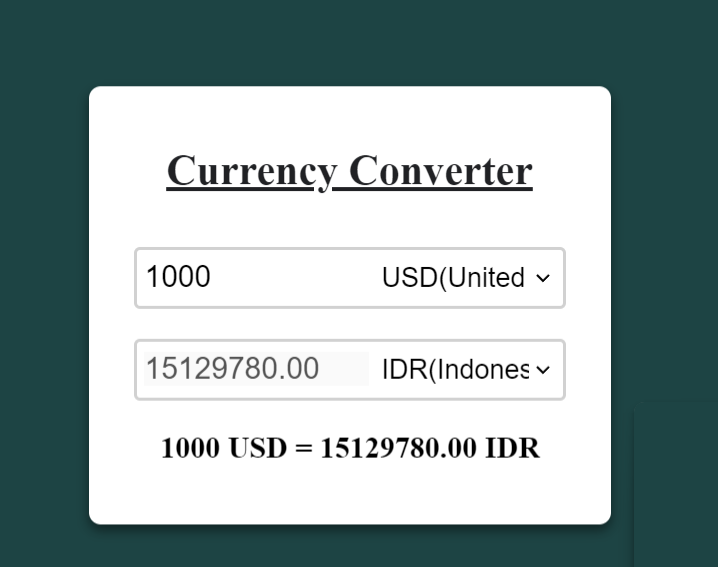

A simple currency converter application built using JavaScript. This tool allows users to convert an amount from one currency to another by fetching real-time exchange rates from API.
Features:-

    Convert between various currencies
    Fetches real-time exchange rates from an API
    Simple and intuitive user interface
    Error handling for invalid inputs
    Responsive design for mobile and desktop users

## Screenshots

Here's a preview of the application:

